

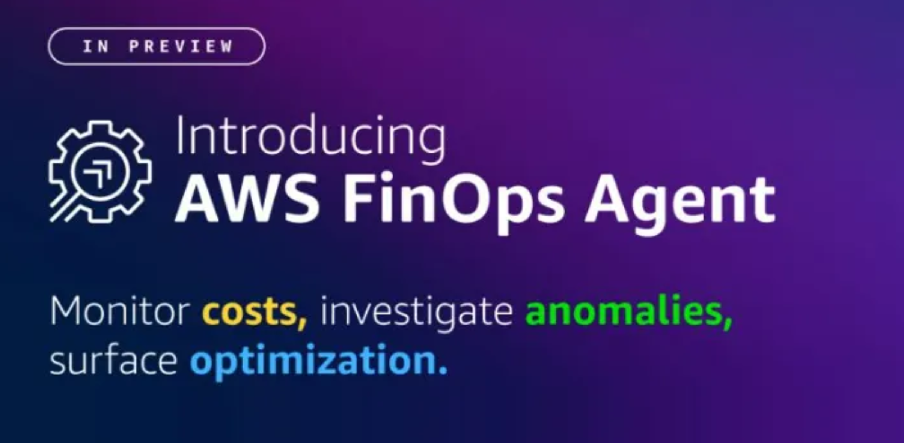

  

# I Deployed the New AWS FinOps Agent and Put It to Work on Real Cost Questions

### Initial Thoughts

 

Cloud cost management usually feels slow, fragmented, and reactive. That is exactly what made **AWS FinOps Agent** worth testing: an agentic AI solution, built on **Amazon Bedrock**, that investigates cost anomalies to root cause and answers cost questions for engineers, inside the tools teams already use.

---

## Table of Contents

- [Overview](#overview)
- [Why I Wanted to Test It](#why-i-wanted-to-test-it)
- [How I Set It Up](#how-i-set-it-up)
- [The Questions I Ran](#the-questions-i-ran)
  - [Question 1: Monthly Cost Change](#question-1-what-was-my-cost-in-may-2026-and-why-did-it-change-compared-to-the-previous-month)
  - [Question 2: Six-Month Executive Summary](#question-2-generate-a-six-month-executive-cost-summary)
  - [Question 3: One-Week Cost Reduction Plan](#question-3-if-i-had-only-one-week-to-reduce-cloud-costs-where-should-i-focus)
- [What Stood Out Most](#what-stood-out-most)
- [The Strongest Business Value I See](#the-strongest-business-value-i-see)
- [Author](#author)

---

## Overview

| | |
|---|---|
| **Product** | AWS FinOps Agent (Public Preview) |
| **Foundation** | Amazon Bedrock |
| **Primary function** | Cost Q&A, anomaly investigation, recurring reporting, optimization recommendations |
| **Data sources** | AWS Cost Explorer, Cost Anomaly Detection, Cost Optimization Hub, Compute Optimizer |
| **Integrations** | Jira, Slack |
| **Default region** | us-east-1 |

AWS launched FinOps Agent in public preview as an agentic AI solution for cloud financial management. It investigates cost anomalies to root cause and answers cost questions for engineers across an organization, inside the tools teams already use.

  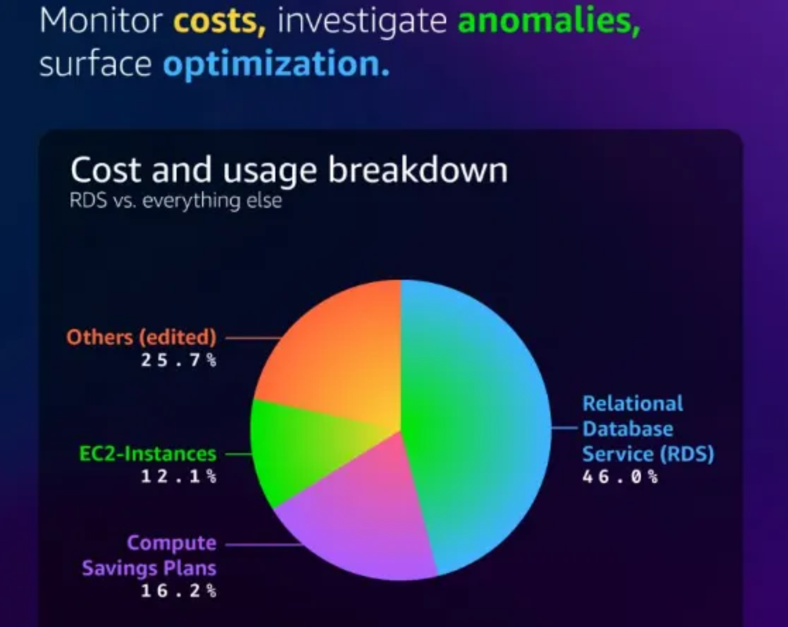

<b>Figure 1.</b> A sample cost and usage breakdown generated by the agent.

It is built on Amazon Bedrock, and AWS says it is designed to continuously monitor costs, surface optimization opportunities, and fit into workflows teams already use.

---

## Why I Wanted to Test It

Most FinOps work still starts with someone asking a simple question and ending up inside three or four consoles, a spreadsheet, a ticketing tool, and a chat thread.

AWS FinOps Agent changes that pattern by combining cost answers, anomaly investigation, recurring reports, and optimization recommendations in one place.

The agent can correlate cost changes with **AWS CloudTrail** events, identify the change behind a spike, and route findings to the right team through **Jira** or **Slack**.

That is the real promise here. Not just reporting, but faster decisions. It is well positioned as a way to move FinOps from manual monthly reviews toward continuous operations, where anomalies are investigated before they compound and engineers can get cost answers on demand.

---

## How I Set It Up

The AWS FinOps Agent is set up from the AWS FinOps Agent console through a five-step wizard.

  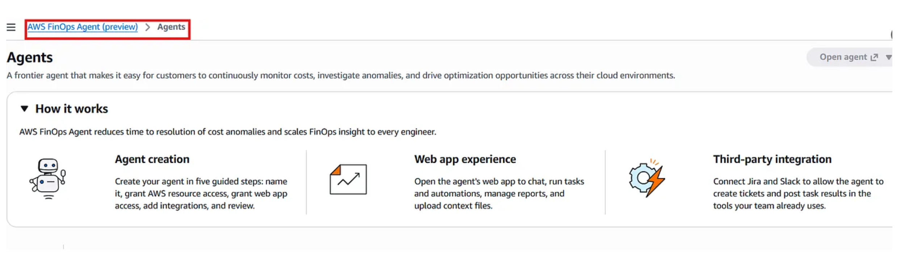

<b>Figure 2.</b> The AWS FinOps Agent console, showing agent creation, the web app experience, and third-party integrations.

 

<table>
<tr>
<td width="90" align="center"><b>Step 1</b></td>
<td>Name the agent (required) and provide a description for it (optional).</td>
</tr>
<tr>
<td colspan="2" align="center">
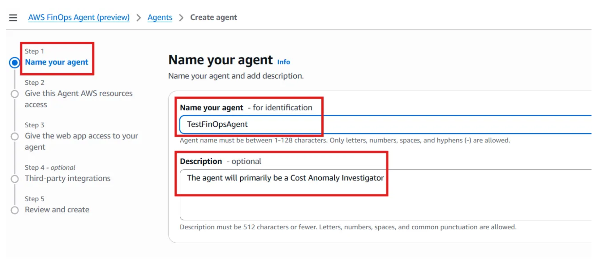
 <b>Figure 3.</b> Naming and describing the agent.
</td>
</tr>
<tr>
<td width="90" align="center"><b>Step 2</b></td>
<td>Choose which AWS resources it can access. You can auto-create a role or use an existing role. A unique name is suggested and can be modified.</td>
</tr>
<tr>
<td colspan="2" align="center">
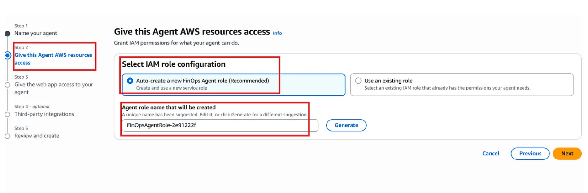
 <b>Figure 4.</b> Configuring AWS resource access.
</td>
</tr>
<tr>
<td width="90" align="center"><b>Step 3</b></td>
<td>Give the web app access permissions using an auto-created operator role or an existing role. An agent role name is suggested and editable. I let the wizard auto-create the needed IAM roles.</td>
</tr>
<tr>
<td colspan="2" align="center">
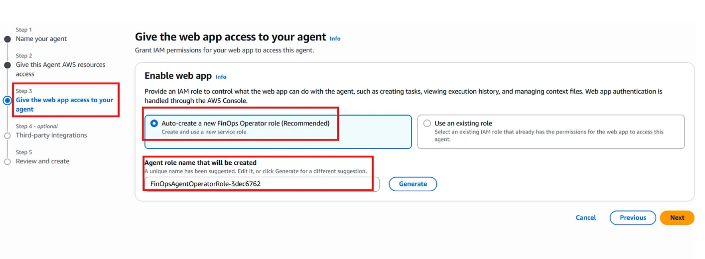
 <b>Figure 5.</b> Granting the web app access, and IAM role setup.
</td>
</tr>
<tr>
<td width="90" align="center"><b>Step 4</b></td>
<td>Connect third-party integrations such as Jira and Slack (optional).</td>
</tr>
<tr>
<td colspan="2" align="center">
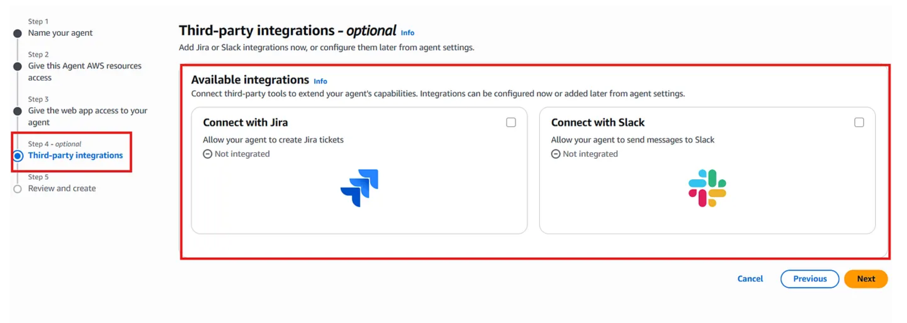
 <b>Figure 6.</b> Connecting Jira and Slack integrations.
</td>
</tr>
<tr>
<td width="90" align="center"><b>Step 5</b></td>
<td>Review and create. Upon successful creation, the agent appears under the Agents tab. Confirm the name, description, and creation date, then click <b>Open Agent</b> to launch it.</td>
</tr>
<tr>
<td colspan="2" align="center">
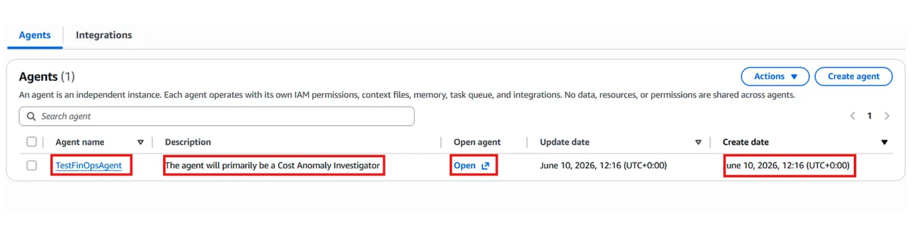
 <b>Figure 7.</b> The agent appears under the Agents tab after creation.
</td>
</tr>
</table>

> **Note:** The preview setup in the AWS Management Console defaults to the **us-east-1** Region. The standard flow also includes the option to upload optional context alongside your queries.

---

## The Questions I Ran

After clicking **Open Agent**, I waited a few seconds for it to launch. From there, you can type a query directly or pick from the available common-task questions.

  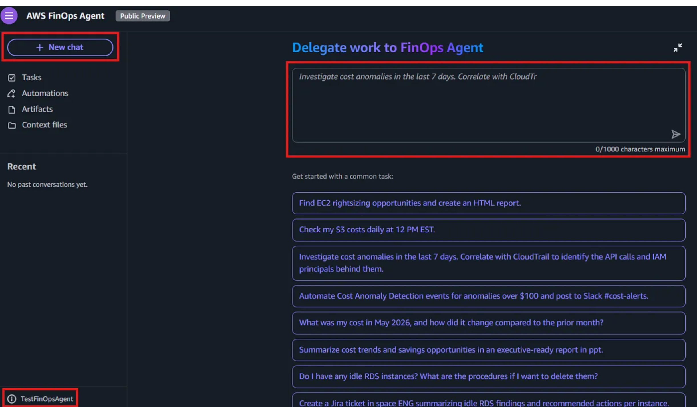

<b>Figure 8.</b> The agent's chat screen, with common-task question suggestions.

Once the agent was live, I tested it with the kind of business questions I believed teams will actually ask when they are under pressure and need answers quickly.

### Question 1: *"What was my cost in May 2026, and why did it change compared to the previous month?"*

The agent provided a brief summary, followed by a tabular breakdown, and detailed descriptions after the table comparing it to the previous month, focusing on the services that incurred cost.

  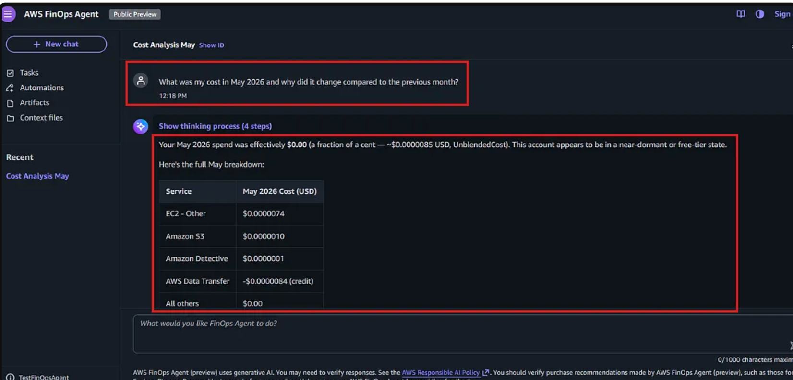

<b>Figure 9.</b> Summary and tabular breakdown of May 2026 costs.

  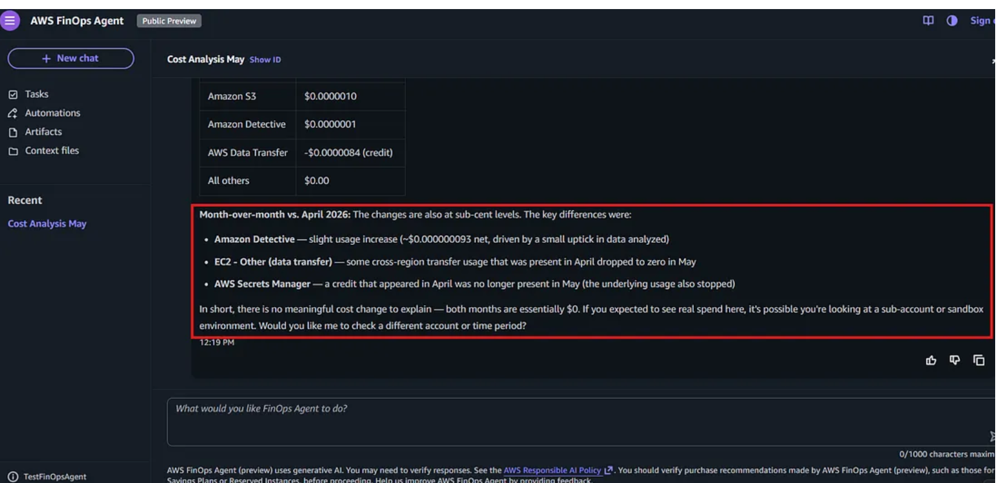

<b>Figure 10.</b> Month-over-month comparison, broken down by service.

### Question 2: *"Generate a six-month executive cost summary."*

I proceeded to get an excellent summary breakdown, followed by a downloadable report with comprehensive and highly detailed information. Beyond that, I was also delighted to see excellent charts and visualizations of the monthly expenditures, and projected costs for the next month. Finally, I got to see the top services I spend on and recommendations to optimize future spending, all from one simple prompt.

  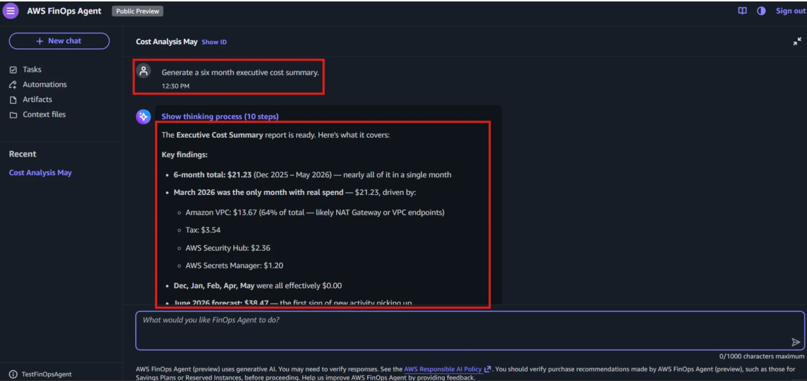

<b>Figure 11.</b> The six-month executive summary, with key findings.

  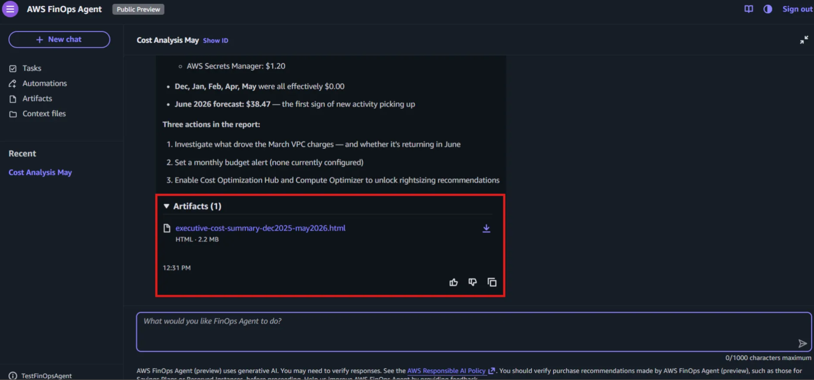

<b>Figure 12.</b> Recommended actions and the downloadable report artifact.

  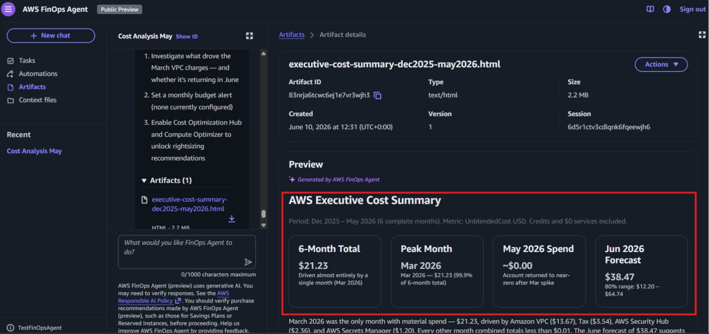

<b>Figure 13.</b> The downloaded AWS Executive Cost Summary report.

  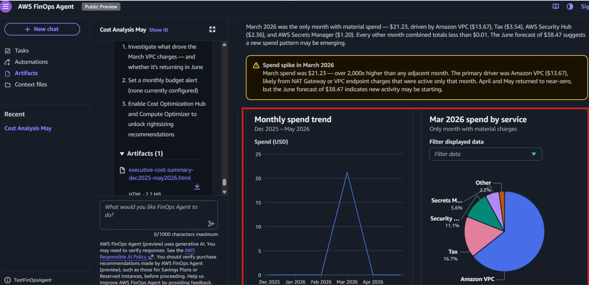

<b>Figure 14.</b> Monthly spend trend and a breakdown of the March 2026 spend spike.

  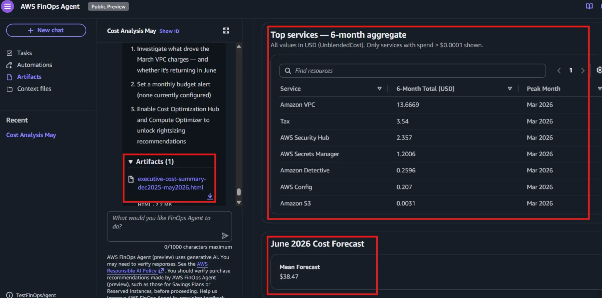

<b>Figure 15.</b> Top services by six-month aggregate spend, with the June 2026 forecast.

  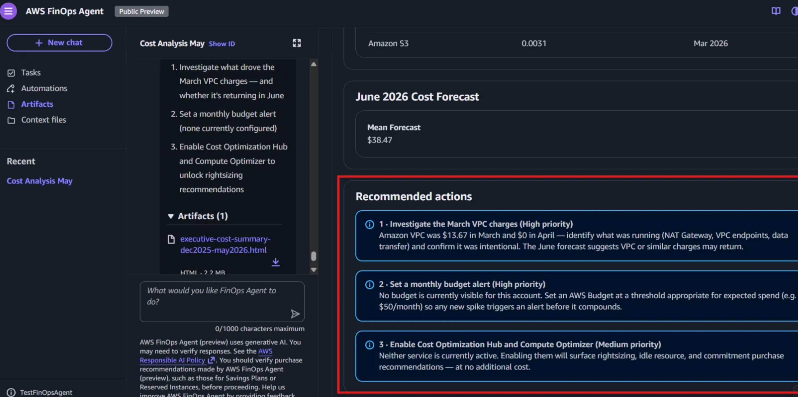

<b>Figure 16.</b> Prioritized recommendations for optimizing future spending.

### Question 3: *"If I had only one week to reduce cloud costs, where should I focus?"*

  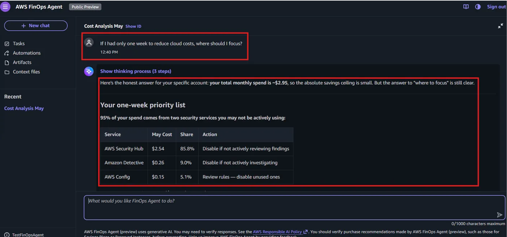

<b>Figure 17.</b> A focused, one-week cost-reduction priority list.

I believe these questions are a simple, but a good first test because they cover the FinOps loop: historical analysis, comparative explanation, optimization, stakeholder reporting, and urgent cost reduction. The agent is designed for exactly those workflows.

---

## What Stood Out Most

The first thing that stood out was how natural the interaction felt. Instead of forcing me to translate a business question into a dashboard hunt, the agent is intended to respond to plain-language prompts.

The second thing that stood out was the breadth of source data. The agent draws on:

| Source | Purpose |
|---|---|
| **AWS Cost Explorer** | Historical cost and usage data |
| **AWS Cost Anomaly Detection** | Identifying and explaining spend anomalies |
| **AWS Cost Optimization Hub** | Centralized optimization recommendations |
| **AWS Compute Optimizer** | Resource right-sizing guidance |

The answers are intended to reflect the same core cost and usage data that central FinOps teams rely on.

These are all useful because it compresses the time between a cost signal and a meaningful response. It also helps with reporting, which is often the most time-consuming part of FinOps. AWS explicitly describes the agent as being able to create and schedule recurring reports and surface optimization recommendations, helping to speed up anomaly handling and monthly reporting.

---

## The Strongest Business Value I See

For me, the best value is not just "answering questions faster." It is creating a shared operating layer for finance, engineering, and platform teams:

- One place to investigate a spike
- One place to ask a cost question
- One place to generate stakeholder reports
- One place to turn recommendations into action

That makes the product especially relevant for teams that are growing quickly, running many AWS accounts, or spending too much time reconstructing cost stories by hand.

The AWS FinOps Agent feels like a meaningful step forward because it turns FinOps from a reporting function into an operational one.

The most exciting part is that this is still preview. That means the workflow is still evolving, but the direction is clear: AWS wants cost intelligence to live where engineers already work, with enough context to act immediately.

---

## Author

**Roland Mawuli Awuku**

Cloud and security professional focused on building secure, scalable, and production-ready systems on AWS (5x AWS Certified).

---

Originally published on <a href="https://medium.com/@awukurolandmawuli/i-deployed-the-new-aws-finops-agent-and-put-it-to-work-on-real-cost-questions-initial-thoughts-49e7ce4685f3">Medium</a>.

